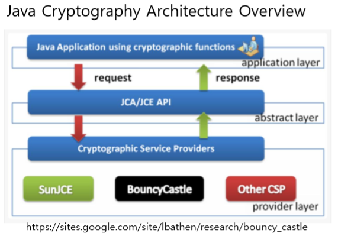

# Introduction of Bouncy Castle and Provider Framework

## Introduction of Bouncy Castle
Bouncy Castle is a cryptography library. This is consist of JAVA and C#.
Bouncy Castle sponsored by the Australian organization, isn't controlled by US Cryptography regulation (part of the EAR).
So you can freely use this, regardless of US law.

This library had a flaw that re-organizing crypto-library when changing the task in server-side Java SE.
It is developed by a developer who interested in Java ME (J2ME) development.
The goal of this library is to contain various crypto algorithms.
This project established in May 2000.
this is only supported by JAVA. In 2004, the project started support language C#.

And Simliar library for Android had released named Spongy Castle in early in 2014.
It is a customised Bouncy Castle for Android.
But this library has collision to the existed class name, doesn't standard of Android Application development.

## Introduction of Java Provider Framework

---------------------
Java Provider Framework is the structure for loading crypto-related library in the JAVA environment.
This consist of hierarchically, from Application, the abstract hierarchy of JCA / JCE, and Provider hierarchy.

### Application hierarchy
Here is an environment for the development Application.
For example, Eclipse, IntelliJ is application hierarchy in this concept.

### Hierarchy of JCA / JCE
The reason that made this layer is, by regulation that not to export cryptography of US government. 
JCA provides a basic structure for cryptographic processing, Include in java.security.
JCE provides implement of cryptography like encryption and decryption, Include in javax.crypo.
So some of the crypto-algorithms regulated by the US government deployed by part of JCE.
Thanks to PGP, US regulation is mitigated from yesterday, JCE is included in JDK 1.4 Version.
JCA is part of the provider layer, It connects application and crypto-provider.

### Provider hierarchy
Crypto-provider(combination of crypto-library) is in the layer.
Through this layer, You can easily change and add many providers in JAVA.
If this layer is closer to the JAVA core layer, It is difficult to add or change many providers. Flexibility for editing provider will be dropped.
Provider can be add by adding a .jar files as a external library or enlist in provider list in JAVA_HOME/jre/lib/security/java.security.

## References
- http://andang72.blogspot.com/2017/02/blog-post.html
- https://docs.oracle.com/javase/7/docs/api/java/security/Provider.html
- https://www.wikiwand.com/en/Bouncy_Castle_(cryptography)
